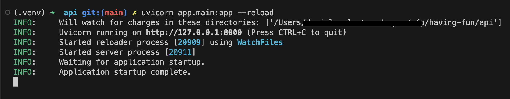
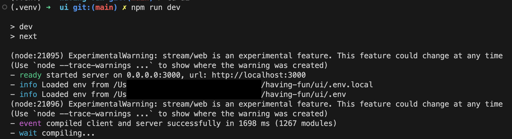

# Technical Assessment project 
Candidate ID: **8498371**


## Project components
The project includes two components:
- API
- User Interface

### API


The backend component (API) is written in Python 3.9 and it is based on:
- [FastAPI framework](https://fastapi.tiangolo.com/)

Features implemented in the project:
- Github actions configuration form:
  - Code formatting and linting ([black](https://pypi.org/project/black/))
  - Strict type checking ([mypy](https://pypi.org/project/mypy/))
  - Static code analysis ([bandit](https://pypi.org/project/bandit/))
  - Dependencies security checks ([safety](https://pypi.org/project/safety/))
  - Testing ([pytest](https://pypi.org/project/pytest/))
  - Automatic Deployment to Deta Science ([project URL](https://havingfun-1-s6152278.deta.app/docs)) of the `main` branch
- Visual studio configuration for code formatting and linting.

Additional technical information can be found in the `./api/README.md`.

### User Interface


The project UI is  a `next js` project that includes:
- `react js` as UI framework
- `chakra ui` for the UI components
- `recharts` for data visualization
- `TypeScript` as programming language
- Code formatting using `prettier`
- Code linting using `lint`
- Automatic deployment to `Vercel` ([project URL](https://having-fun.vercel.app/))of the `main` branch. 

Additional technical information can be found in the `./ui/README.md`.

## Local development

Prerequisites:
- `Python 3.9`
- `yarn`

Run the `./scripts/bootstrap.sh` script to initialize your local environment. The script will:
- Create a `python virtual env` in the `./api` folder and will download the project `dev` dependencies
- Install the UI dependencies
- Install a pre-commit hook for code formatting and linting and enforce common programming style.


### Develop the API
Once bootstrapped the project, start the local development server with the following command:

```
# Browse the `./api` folder
cd ./api
source .venv/bin/activate
uvicorn app.main:app --reload
```

And access the local server using the URL displayed in the terminal. 



Browse the Swagger API documentation locally at `http://127.0.0.1:8000/docs` to get additional information on the API signatures. 

The [Postman API](https://www.postman.com/) collection I utilized during the development is available at `./api/tests/postman/assignment.postman_collection.json`, while running locally the project you can browse the Swagger API doc at `http://127.0.0.1:8000/docs` for more details.

### Develop the UI
Once bootstrapped the project, start the local development server with the following command:

```
# Browse the `./api` folder
cd ./ui
npm run dev
```

And access the local server using the URL displayed in the terminal. 



### Git commit messages
Git commit are following the [Conventional Commits](https://www.conventionalcommits.org/en/v1.0.0/).
Since a pre-commit hook is installed, ensure that you always commit from the project directory and the `python virtual env` is active.  
A light-weight `venv` is created also in the root folder, for case in which only the UI is developed. 
Once the project is bootstrap, you can activate from the project root using:

```
# From the project root
source .venv/bin/activate
```

Enjoy!